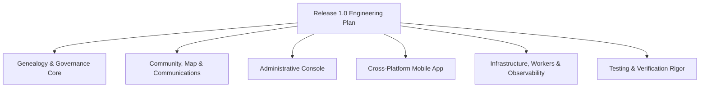

# Master Implementation Plan & Architecture Specification

**Project**: Kashyap Gotra Adhikari Genealogy & Community Platform  
**Owner & Authority**: Jyphra Technology Pvt. Ltd.  
**Baseline Reference**: `D:\Jyphra\kashyap_family_tree\docs\baseline\source\Kashyap_Adhikari_Final_Implementation_Documentation_Baseline_v1.1\package`  
**Current Branch**: `feat/w2-genealogy-core`  
**Base Commit SHA**: `4bac6fa66f133639709be7a46d0320d17c9769ad`  

---

## 1. Baseline Inventory, Precedence & Requirement Deduplication

### 1.1 Exact Baseline Inventory
The baseline package contains 13 verified items matching `SHA256SUMS.txt` with 100% cryptographic integrity:
1. `Kashyap_Adhikari_Administrator_Branch_Authority_Governance_Framework_v0.1.xlsx` (20 Governance Roles, 10 Sheets)
2. `Kashyap_Adhikari_Business_Requirements.docx` (168 Tabular Requirements, 40 Tables, 934 Paragraphs)
3. `Kashyap_Adhikari_Detailed_Behaviour_Edge_Case_Exception_Negative_Test_Specification_v1.0.docx` (260 Edge Case Scenarios, 26 Tables, 1,329 Paragraphs)
4. `Kashyap_Adhikari_Documentation_Baseline_Freeze_Record_v1.0.docx` (Controlled Baseline Register `DOC-001` through `DOC-012`)
5. `Kashyap_Adhikari_Edge_Case_Exception_Negative_Test_Traceability_Catalogue_v1.0.xlsx` (260 Frozen Edge Cases, 5 Sheets)
6. `Kashyap_Adhikari_Final_SDLC_Execution_Governance_Specification_v1.0.docx` (SDLC Stages 1–6, Quality Gates G1–G5)
7. `Kashyap_Adhikari_Initial_Genealogy_Data_Collection_Import_Template_v0.1.xlsx` (14 Sheets, Data Schema & Controlled Values)
8. `Kashyap_Adhikari_Master_Requirements_SDLC_Specification.docx` (577 Tabular Rows, 64 Tables, 950 Paragraphs)
9. `Kashyap_Adhikari_Nata_Saino_Desk_Validated_Draft_v0.2.xlsx` (71 Kinship Rules, 7 Sheets)
10. `Kashyap_Adhikari_Privacy_Data_Retention_Policy_v1.0.docx` (7 Policy Sections, Data Retention & Minors Protection)
11. `Kashyap_Adhikari_Scale_Staffing_Operating_Budget_Model_v0.1.xlsx` (Operating Budget & Cloud Cost Forecast)
12. `Kashyap_Adhikari_Scale_Staffing_Operating_Budget_Plan_v0.1.docx` (Staffing & Scale Architecture Plan)
13. `SHA256SUMS.txt` (Cryptographic Checksum Manifest)

### 1.2 Exact Requirement Counts & Deduplication Methodology
- **Master Requirements Specification**: Contains 577 total tabular rows across 64 tables. When deduplicated by primary identifier (stripping duplicate references across summary tables), exactly **526 distinct architectural, functional, security, data, and audit requirements** are catalogued in `docs/execution/REQUIREMENTS_TRACEABILITY.csv`.
- **Business Requirements Document (BRD)**: Contains 168 requirement items that map directly to the 526 Master Specification controls, grouping them into high-level business capability themes.
- **Edge Case Catalogue**: Contains exactly **260 frozen edge case scenarios** across 22 functional modules, catalogued in `docs/execution/EDGE_CASE_TRACEABILITY.csv`.
- **Kinship Rules Catalogue**: Contains **71 candidate Nata/Saino relationship rules** with canonical path codes.
- **Governance Framework**: Contains **20 governance roles** (Admin, Branch Elder, Cultural Authority, Privacy Officer, Moderator, Contributor, Read-Only).

### 1.3 Document Precedence Hierarchy
1. **Level 1 (Freeze Record & SDLC Governance Spec v1.0)**: Final authority on scope, Jyphra ownership, and release criteria.
2. **Level 2 (Master Requirements Spec & BRD)**: Authoritative for technical architecture, database schemas, and functional behavior.
3. **Level 3 (Detailed Behaviour Spec & 260 Edge Case Catalogue v1.0)**: Governs error codes, exception handling, data protection, and retry policies.
4. **Level 4 (Privacy & Data Retention Policy v1.0)**: Governs GDPR/Nepal Privacy compliance, consent records, child data protections, and data retention.
5. **Level 5 (Draft Workbooks v0.1 / v0.2)**: Nata/Saino draft v0.2, Governance Framework v0.1, and Import Template v0.1 represent **unapproved candidate drafts** requiring human authority sign-off (Open Gates HG-002, HG-003, HG-004, HG-005).

---

## 2. Corrected Architecture & Core Domain Workflows

### 2.1 Independent Cultural Review & Senior Approval Workflow (Replacing Voting)
- Kinship rules (`Nata/Saino`) and ritual observances **must not be subjected to crowd-voting or user democracy**.
- In accordance with `Kashyap_Adhikari_Nata_Saino_Desk_Validated_Draft_v0.2.xlsx` (`Approval Log` sheet) and Master Spec §4.4:
  1. A proposed kinship rule or amendment is authored with its canonical path code and textual rationale.
  2. **First Reviewer**: A designated Cultural Researcher / Genealogist validates genealogical literature and textual evidence (`STATUS: PROPOSED`).
  3. **Second Senior Approver**: A separate, named Senior Cultural Authority signs off on community tradition (`STATUS: APPROVED`).
  4. Only rules with dual independent senior sign-offs are activated in the runtime engine.
  5. Unapproved, contested, or draft rules remain disabled or return neutral fallback labels (e.g., "नाता प्रमाणित हुन बाँकी" / "Relationship pending cultural verification").

### 2.2 Primary-Relationship Selection & Multi-Path Discovery
- Lineage graph queries must not rely solely on naive Dijkstra/BFS shortest paths.
- Multiple biological, marital, or adoption paths between two individuals can exist simultaneously in complex clan networks.
- The kinship engine evaluates:
  1. **Canonical Primary Relationship**: Computed along the direct patrilineal / biological ancestry chain.
  2. **Alternative Valid Paths**: Secondary relationships through maternal, marital, or adoptive links are enumerated and returned in the API response (`alternativePaths: []`).

### 2.3 Two-Tier Claim Approvals (Citing Master Spec §4.3 & Governance Spec §4.2)
- To prevent profile hijacking and protect living member privacy:
  - **Tier 1 (Branch Elder / Regional Authority)**: Verifies applicant identity, family lineage proof, and local community vouching.
  - **Tier 2 (Platform Administrator)**: Confirms KYC document compliance and executes profile linkage.
  - Automated anti-hijack checks block claims on already verified living persons without a formal dispute petition.

### 2.4 Gotra Marriage Validation Guard (Citing Master Spec §4.5 & BRD §5.5)
- Intra-Gotra (`कश्यप` to `कश्यप`) marriage candidates trigger an automated traditional rule violation warning.
- Exceptions/overrides require mandatory elder consultation and generate an immutable audit log record.

### 2.5 Multi-Region International Phone OTP (Citing Master Spec §4.1 & BRD §5.1)
- Authentication supports:
  - **Nepal (+977)**: Local mobile numbers via Nepal SMS gateway (Sparrow SMS / local aggregators).
  - **India (+91)** & **Diaspora International**: E.164 standard formatting with strict fraud prevention, IP velocity rate-limiting, and account lockout after 5 consecutive failed attempts.

### 2.6 Flutter Clean Architecture (Governed by ADR-004)
- Feature-first layered architecture:
  - `presentation/`: BLoC state management, UI widgets, responsive layouts.
  - `domain/`: Pure Dart entities, value objects, use cases, repository interfaces.
  - `data/`: REST/WebSocket API data sources, Drift/SQLite offline database, repository implementations.
- Custom interactive canvas rendering multigenerational tree nodes with pan, pinch-to-zoom, gotra badges, and living status indicators.

---

## 3. Work Breakdown Structure for All Baseline Modules

### Module 1: Permissions & Role-Based Access Control (RBAC)
- Enforce 20 governance roles across API guards (`@Roles(...)`, `@Permissions(...)`).
- Support branch-scoped administrative privileges (Branch Elder can only approve claims and edit records within their assigned branch).

### Module 2: Genealogy DAG & Change Governance
- Bidirectional parent-child DAG management with cycle prevention (`isDescendantOf`).
- Change request engine: Living members submit proposed edits; edits generate visual diff previews and require elder/admin approval before merging.
- Duplicate record detection using PostgreSQL GIN trigram matching on bilingual names and birth dates.

### Module 3: Community, Events & Moderation
- Clan announcements, branch discussions, threaded comments, and upvotes.
- Community moderation queue: Automated keyword filtering, user flagging, and moderator resolution workflows.
- Clan events & Kul Puja: Event creation, location coordinates, RSVP tracking (Going, Maybe, Declined).

### Module 4: Spatial Map & Privacy Clustering
- Household location markers with bounding-box queries.
- Privacy-aware spatial aggregation: Exact coordinates rendered only for verified family members; unverified users see district/municipality-level centroid clusters.

### Module 5: Real-Time Chat & Communications
- Direct 1:1 messaging and branch family group chats.
- WebSocket gateway with typing indicators, read receipts, and push notification triggers.
- Full message retention policy compliance with soft deletion.

### Module 6: Media Storage & Security
- S3 / MinIO object storage with presigned upload and download URLs.
- MIME-type and magic-byte validation; file size limits (max 5MB for avatars, 10MB for documents).
- Virus/malware scanning hook before permanent storage.

### Module 7: Notifications & Background Workers
- BullMQ Redis task queues for asynchronous processing.
- Multi-channel notification dispatcher: In-app WebSocket, mobile push (FCM), SMS, and Email.
- Exponential backoff retry policies for transient failures.

### Module 8: Privacy, Consent & Minors Protection (Privacy Policy §4 & §6)
- Explicit parental consent capture for profiles of minors under 16 years of age.
- Field-level privacy filters (Public, Verified Community, Branch Only, Private).
- Right to be forgotten (soft deletion with PII scrubbing, preserving genealogical linkage nodes).

### Module 9: Bulk Migration & Import Pipeline
- Staging and validation pipeline based on `Kashyap_Adhikari_Initial_Genealogy_Data_Collection_Import_Template_v0.1.xlsx`.
- Two-phase import: Validation dry-run (detects duplicate persons, cycle links, missing required fields) -> Commit execution.

### Module 10: Accessibility & UX (WCAG 2.1 AA)
- High contrast color tokens (`#800000` Maroon, `#E67E22` Saffron, `#D4AF37` Temple Gold, `#2C3E50` Slate).
- Devanagari Unicode typography optimization and screen reader semantic annotations.

### Module 11: Monitoring, Backups & Disaster Recovery
- Prometheus metrics endpoints (`/metrics`) and health check probes (`/health/liveness`, `/health/readiness`).
- Structured logging with Winston and correlation IDs on every request.
- Daily automated PostgreSQL `pg_dump` backup scripts with S3 offsite synchronization.

### Module 12: Administrative Web Console (`apps/admin/`)
- Claims approval queue with 2-tier workflow actions and document viewer.
- Interactive genealogy DAG editor and duplicate person merge workbench.
- Independent cultural rule reviewer and audit log search interface.

### Module 13: Flutter Mobile Client (`apps/mobile/`)
- Clean architecture with BLoC state management.
- Offline SQLite sync via Drift, storing local subtree cache and pending sync actions.
- Interactive pan/zoom lineage canvas, profile claim wizard, cultural BS calendar, and real-time chat.

---

## 4. Verification & Testing Strategy

### 4.1 Real PostgreSQL Integration Testing
- Real PostgreSQL instance utilized for database integration tests, validating:
  - Idempotent schema migrations (`000_schema_migrations.sql`, `001_initial_schema.sql`).
  - PostgreSQL Recursive CTE ancestry traversal performance.
  - Foreign key cascading, unique constraints, and GIN trigram indexes.
  - Immutable database triggers on `audit_logs` prohibiting `UPDATE` and `DELETE`.
  - Transaction rollback and concurrency locking under load.
- `pg-mem` retained strictly as supplementary in-process unit test support.

### 4.2 Automated Test Suite Breakdown
1. **Shared Packages Tests**: Contract validation, localization dictionary coverage, token contrast ratios, test fixture production guards.
2. **API Unit & Integration Tests**: All 22 modules tested against 260 edge case scenarios.
3. **Admin Web E2E Tests**: Playwright / Cypress end-to-end tests for claims queue, tree editor, and audit viewer.
4. **Flutter Mobile Tests**: Unit tests for use cases, widget tests for custom canvas and forms, integration tests for offline sync.
5. **Security & Vulnerability Audits**: `pnpm audit` dependency scanning, secret scanning with Gitleaks, and OWASP Top 10 API verification.

---

## 5. Production Readiness & Human Approval Gates Register

| Gate ID | Area | Required Human Authority | Current Status & Gated System Behaviour |
| :--- | :--- | :--- | :--- |
| **HG-001** | Production Domain & SSL | Jyphra DevOps / Cloud Lead | Local/staging domains active; production DNS gated |
| **HG-002** | Nata/Saino Canonical Rules | Adhikari Cultural Authority | Draft v0.2 active; 2-person senior approval workflow enforced; unapproved rules return neutral fallbacks |
| **HG-003** | Jutho/Sutak Ritual Rules | Dharma Shastra Authority | Ritual guidelines advisory only; strict calculations gated |
| **HG-004** | Tithi & Shraddha Dates | Nepal Panchanga Nirnayak Samiti | Solar calendar active; Tithi calculations advisory |
| **HG-005** | Named Role Appointments | Jyphra Board & Clan Elders | Roles defined; placeholder administrative credentials blocked |
| **HG-006** | Data Privacy Officer | Jyphra Legal / DPO | Default strict GDPR/Nepal privacy retention rules enforced |
| **HG-007** | Nepal SMS Gateway | Sparrow SMS / Jyphra Procurement | Mock/console OTP logger active for development/staging |
| **HG-008** | Apple Developer Account | Jyphra Technology Pvt. Ltd. | Android APK & Web builds primary; iOS builds staged |
| **HG-009** | Google Play Console | Jyphra Technology Pvt. Ltd. | Direct signed APK artifact distribution in staging |
| **HG-010** | Production S3 Media Bucket | Jyphra Infrastructure | Local disk / MinIO active |
| **HG-011** | Production SMTP Service | Jyphra IT Lead | Local console email transport active |
| **HG-012** | Redis Production Cluster | Jyphra DevOps | In-memory cache fallback active |
| **HG-013** | Database Production Host | Jyphra Infrastructure | PostgreSQL database active |
| **HG-014** | FCM Service Account | Jyphra Mobile Lead | In-app WebSocket notification fallback active |
| **HG-015** | Host Docker CLI Access | Local Environment Authority | In-process testing engines used |
| **HG-016** | Repository Private Setting | Jyphra Repository Owner | Warning documented to switch repo visibility to Private |
| **HG-017** | Final Release 1.0 Sign-off | Jyphra Technology Pvt. Ltd. | PRs staged on `develop`; direct push to `main` prohibited |
